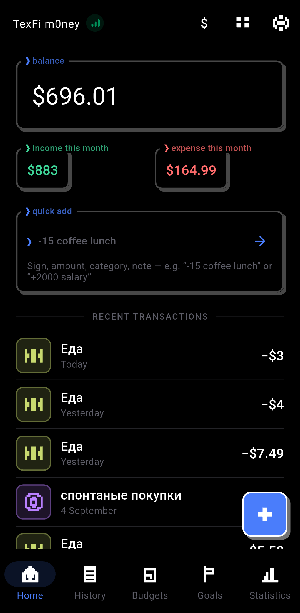
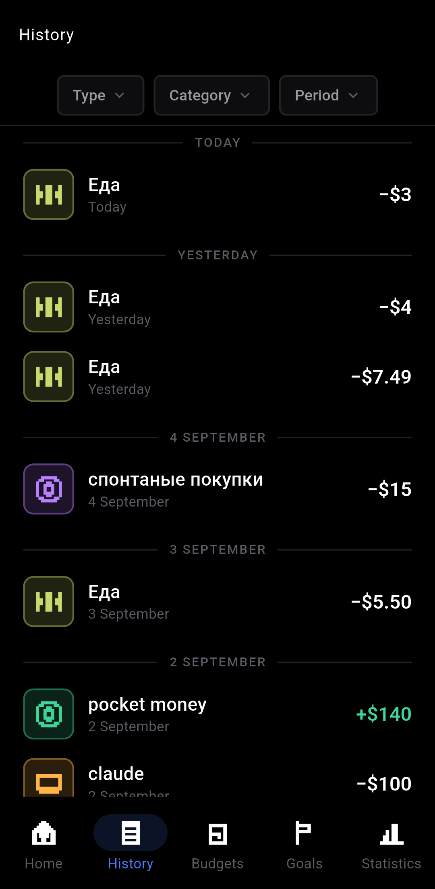
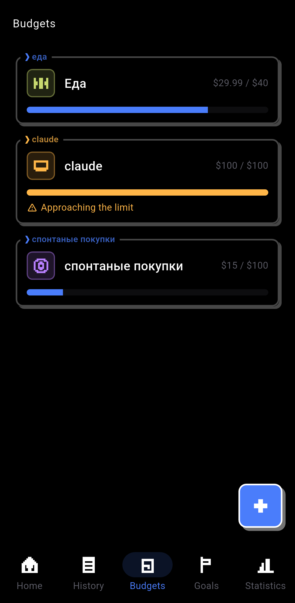
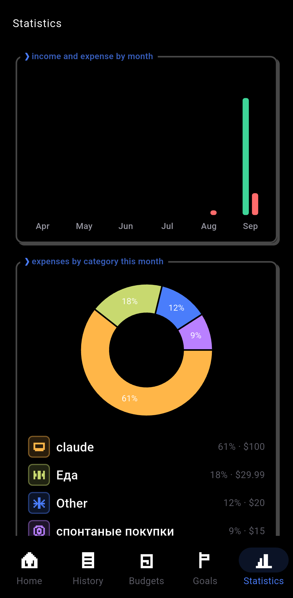

<p align="center">
  
</p>

<p align="center">
  <b>A private, offline personal finance tracker for Android.</b><br>
  Track spending, set budgets, and watch your savings goals grow — no account, no cloud, no ads.
</p>

<p align="center">
  
  
  
  <a href="LICENSE"></a>
</p>

<p align="center">
  <a href="#download">Download</a> ·
  <a href="#screenshots">Screenshots</a> ·
  <a href="#features">Features</a> ·
  <a href="#design">Design</a> ·
  <a href="#stack">Stack</a> ·
  <a href="#project-structure">Project structure</a>
</p>

---

## Download

**Android:** [APK from the latest release](https://github.com/mistqkw/texfi-money/releases/latest)
· or via the site: **[texfi-hub.vercel.app/download/money](https://texfi-hub.vercel.app/download/money)**

There is no desktop build yet — CI builds the APK only. When a Windows or Linux
build lands in a release, the site picks it up on its own.

The APK does not come from Google Play, so Android will ask for permission to
install from this source.

---

## Screenshots

<p align="center">
  
  
  
  
</p>

<p align="center"><i>More on the <a href="https://texfi-hub.vercel.app/download/money">download page</a>.</i></p>

---

## Features

- **Home** — total balance, this month's income/expense, recent transactions
- Add a transaction with amount, category, date, note, income or expense, and an optional account
- Quick add: type one line like `-15 coffee lunch` or `+2000 salary` and it's parsed and committed instantly
- Swipe a transaction away on Home or in History to delete it; the balance pulses to confirm
- Categories — the usual presets plus your own, each with a line-style icon and color
- Accounts for cash and however many cards you actually use (bank A, bank B...), each tracked separately
- Profiles for money you've lent to or borrowed from other people, kept apart from your own accounts
- Budgets: a monthly limit per category with an animated progress bar and a warning as you get close
- Savings goals with a target amount, progress, an optional deadline, and quick top-ups
- Statistics — income/expense by month, plus a pie chart of expenses by category
- History: the full transaction list, filterable by type, category and date range
- Multi-currency display (RUB, USD, EUR, UAH, PLN and more), switch anytime
- Smart nudges. The app quietly flags what's worth a second look — a purchase well above your usual
  for that category ("amount right?"), a budget running low, a goal that's nearly funded, a few quiet
  days with nothing logged. One at a time, and always dismissible.
- Gestures on every transaction: tap to edit, long-press for a menu, swipe left to delete, swipe right
  to repeat it today
- Haptics that aren't just one generic buzz — income rises, expense falls, and a big purchase feels
  heavier than a small one
- Backup and restore: export everything to a JSON file, share it anywhere, and import it back on any
  device. It's the only safety net an offline-only app gets.
- Languages: English, Русский, Polski, Українська, follows the system by default
- Themes and fonts — Dark, Light, pure-black OLED, with Inter, Roboto, Manrope or the system font
- A guided first run walks through the app with an animated onboarding, then lets you pick currency and theme with a live preview

Part of the **TexFi** ecosystem, alongside [TexFi Files](https://github.com/mistqkw/texfi_files) and [TeFBlock](https://github.com/mistqkw/tefblock).

## Design

Dark theme by default, flat minimalism, accent `#4a7dfb` on `#0d0d10`. Large, tabular
figures for amounts; light, small type for labels. No gradients, no shadows, restrained
corner radii (8–12px). Details in [`lib/core/theme`](lib/core/theme).

Every distance comes from one 4pt scale in [`app_spacing.dart`](lib/core/theme/app_spacing.dart)
instead of being eyeballed per screen. Section headings live in the cut-out label of
[`TerminalBox`](lib/presentation/shared/terminal_box.dart) on every screen, and touch
targets stay 48dp even where the visible dot is smaller.

Haptics have their own vocabulary — each event is a short rhythm rather than one generic
buzz. Income rises, expense falls, delete has a fading tail, an error is a firm double
tap, a reached goal gets a small fanfare, and a purchase well above your usual for that
category feels heavier than a routine one. All of it respects a single switch in
Settings. See [`haptics.dart`](lib/core/utils/haptics.dart).

## Stack

- **Flutter** (Android, min SDK 24)
- **State management:** [Riverpod](https://riverpod.dev). Minimal boilerplate, providers
  are easy to test in isolation, and it pairs well with Drift's streaming queries —
  `StreamProvider` over `watch()` queries, no manual subscribe/unsubscribe.
- **Local storage:** [Drift](https://drift.simonbinder.eu) (SQLite), because budget and
  statistics aggregations need full SQL with migrations and joins. The repository layer
  sits behind `domain/repositories`, so server sync could be bolted on later without
  touching the UI.
- **Charts:** fl_chart
- **Architecture:** Clean Architecture — `data/` (Drift, repositories) → `domain/`
  (entities, repository interfaces) → `presentation/` (screens, Riverpod providers).

## Project structure

```
lib/
  core/            theme, constants, utils, localization
  data/
    local/         Drift database, DAO
    repositories/  repository implementations over Drift
  domain/
    entities/      domain models
    repositories/  abstract repository interfaces
  presentation/
    home/
    add_transaction/
    categories/
    accounts/
    profiles/
    budgets/
    goals/
    statistics/
    history/
    onboarding/
    settings/
    shared/
```

---

## License

TexFi m0ney is free software: you can redistribute it and/or modify it under the
terms of the GNU Affero General Public License as published by the Free
Software Foundation, either version 3 of the License, or (at your option) any
later version.

It is distributed in the hope that it will be useful, but WITHOUT ANY
WARRANTY; without even the implied warranty of MERCHANTABILITY or FITNESS FOR
A PARTICULAR PURPOSE. See the [GNU AGPL](LICENSE) for details.

Copyright © 2026 mistqkw
