<p align="center">
  
</p>

<p align="center">
  <b>A private, offline personal finance tracker for Android.</b><br>
  Track spending, set budgets, and watch your savings goals grow — no account, no cloud, no ads.
</p>

<p align="center">
  
  
  
  
</p>

<p align="center">
  <a href="#features">Features</a> ·
  <a href="#design">Design</a> ·
  <a href="#stack">Stack</a> ·
  <a href="#project-structure">Project structure</a>
</p>

---

## Features

- 💰 **Home** — total balance, this month's income/expense, recent transactions
- ➕ **Add transactions** — amount, category, date, note, income or expense, optional account
- ⌨️ **Quick add** — one line, e.g. `-15 coffee lunch` or `+2000 salary`, parsed and committed instantly
- 🗑 **Swipe to delete** — swipe a transaction away on Home or in History; the balance pulses to confirm
- 🏷 **Categories** — presets plus your own, with a line-style icon and color
- 💳 **Accounts** — track cash and multiple cards separately (bank A, bank B...), each with its own balance
- 🤝 **Profiles** — keep tabs on money you've lent to or borrowed from other people, separate from your own accounts
- 📊 **Budgets** — monthly limit per category, animated progress bar, warning near the limit
- 🎯 **Savings goals** — target amount, progress, optional deadline, quick top-ups
- 📈 **Statistics** — income/expense by month, expense breakdown by category (pie chart)
- 🔎 **History** — full transaction list, filterable by type, category and date range
- 💱 **Multi-currency display** — RUB, USD, EUR, UAH, PLN and more, switch anytime
- 💾 **Backup & restore** — export everything to a JSON file (share it anywhere) and import it back on any device — the only safety net for an offline-only app
- 🌍 **Languages** — English, Русский, Polski, Українська, follows the system by default
- 🎨 **Themes & fonts** — Dark, Light, pure-black OLED; Inter, Roboto, Manrope or system font
- 👋 **Guided first run** — animated onboarding walks through the app, then lets you pick your currency and theme with a live preview

Part of the **TexFi** ecosystem, alongside [TexFi Files](https://github.com/mistqkw/texfi_files) and [TeFBlock](https://github.com/mistqkw/tefblock).

## Design

Dark theme by default, flat minimalism, accent `#4a7dfb` on `#0d0d10`. Large, tabular
figures for amounts; light, small type for labels. No gradients, no shadows, restrained
corner radii (8–12px). Details in [`lib/core/theme`](lib/core/theme).

## Stack

- **Flutter** (Android, min SDK 24)
- **State management:** [Riverpod](https://riverpod.dev) — minimal boilerplate, providers are easy to test in isolation, and pairs well with Drift's streaming queries (`StreamProvider` over `watch()` queries with no manual subscribe/unsubscribe).
- **Local storage:** [Drift](https://drift.simonbinder.eu) (SQLite) — full SQL with migrations and joins, which budget/statistics aggregations need. The repository layer is abstracted behind `domain/repositories`, so server sync can be added later without rewriting the UI.
- **Charts:** fl_chart
- **Architecture:** Clean Architecture — `data/` (Drift, repositories) → `domain/` (entities, repository interfaces) → `presentation/` (screens, Riverpod providers).

## Project structure

```
lib/
  core/            theme, constants, utils, localization
  data/
    local/         Drift database, DAO
    repositories/  repository implementations over Drift
  domain/
    entities/      domain models
    repositories/  abstract repository interfaces
  presentation/
    home/
    add_transaction/
    categories/
    accounts/
    profiles/
    budgets/
    goals/
    statistics/
    history/
    onboarding/
    settings/
    shared/
```
